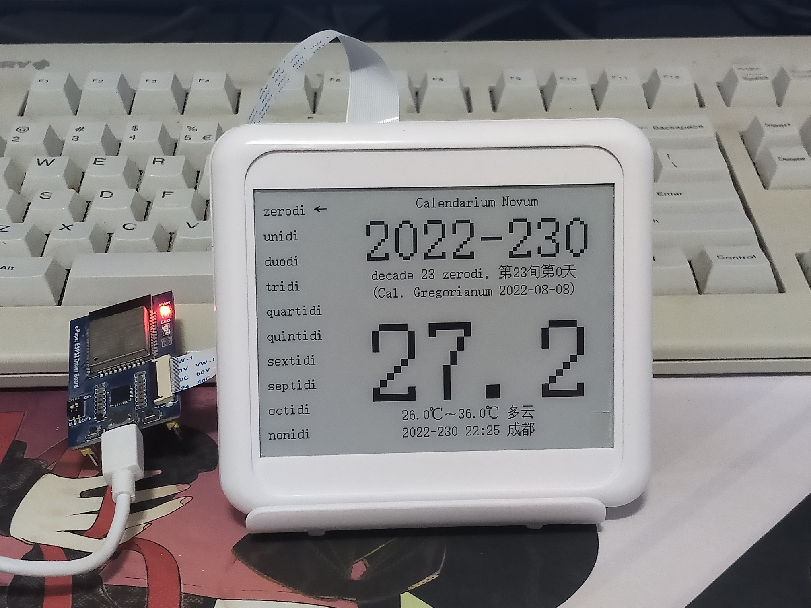

# CalendariumNovumESP32

## 简介

这是一个基于乐鑫ESP32的新日历项目。

## 硬件

[微雪电子墨水屏ESP32驱动板](https://www.waveshare.net/wiki/E-Paper_ESP32_Driver_Board)

[微雪4.2英寸电子墨水屏模块](https://www.waveshare.net/wiki/4.2inch_e-Paper_Module)

其中，驱动板上的ESP32的型号为ESP32-WROOM-32（Xtensa 32-bit LX6 MCU，520KB片上SRAM，4MB集成SPI flash存储）。

## 功能

功能如下：

1. 建立WiFi热点和HTTP服务器以进行WiFi设置，使用了[WiFiManager](https://github.com/tzapu/WiFiManager)

2. 通过网络进行NTP时间同步

3. 通过网络获取天气信息，使用了[中国气象局](https://weather.cma.cn)数据

4. 显示Windows CP20936代码页(GB2312-1980)字符，使用了[Firefly字库图片生成器](https://github.com/IanusInferus/firefly)

5. 显示新日历（以冬至点为起点、去除月亮历影响的纯太阳历日历系统）

## 环境要求

Windows

Visual Studio Code

[PlatformIO](https://platformio.org/)插件

PlatformIO Platform: Espressif 32

## 用户使用协议

本项目是免费自由软件，项目内所有非第三方的源代码和资源均按照Unlicense许可证授权，详见[LICENSE](LICENSE)。
